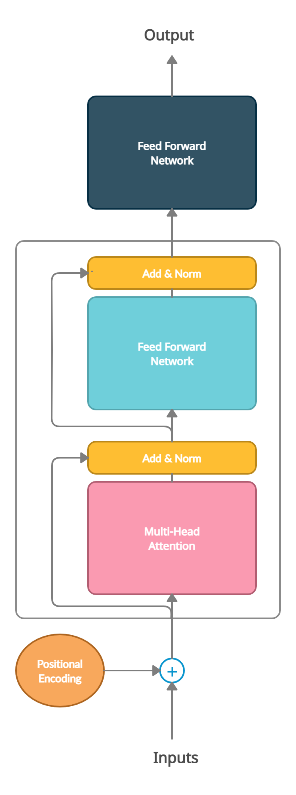

<h1 align="center">Transformers for Market Movement Prediction</h1>

 

    

  

    This project implements and backtests Transformer (Encoder) neural network architecture for market movement prediction.
  

 

## Transformers

A transformer is a deep learning model that adopts the attention mechanism, differentially weighing the significance of each part of the input data. It is used primarily in the field of natural language processing (NLP) and in computer vision (CV). The attention mechanism involved in these neural architectures motivates an individual to try them on time series data.

    
    
Transformer Architecture "Attention Is All You Need"

 

## Our Model Architecture

    

 

## References

- [Attention Is All You Need](https://arxiv.org/abs/1706.03762)
- [Models with Attention by Jay Alammar](https://jalammar.github.io/visualizing-neural-machine-translation-mechanics-of-seq2seq-models-with-attention/)
- [The Illustrated Transformer by Jay Alammar](https://jalammar.github.io/illustrated-transformer/)
